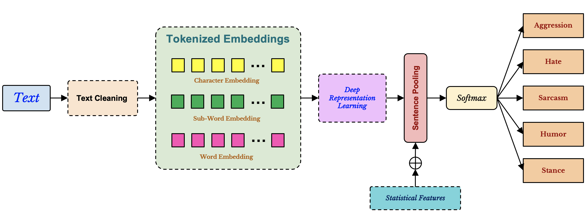

# Hate_detection

Code-Mixed Hate Classification

### Architecture



### Data Sources

* Hinglish offensive Tweets - https://github.com/pmathur5k10/Hinglish-Offensive-Text-Classification
* Humor detection corpus - https://github.com/Ankh2295/humor-detection-corpus
* Sarcasm detection dataset - https://github.com/sahilswami96/SarcasmDetection_CodeMixed
* Stance detection dataset - https://github.com/sahilswami96/StanceDetection_CodeMixed
* Aggression Identification Data - https://github.com/kraiyani/Facebook-Post-Aggression-Identification
* Hinglish Hate speech dataset - 

### Ideas for the work

 - [x] Transformer for classification
 - [x] Effectiveness of transfer learning from one dataset to another
 - [x] Pseudo labelling for multi-task learning
 - [x] Causal interpretation of model to interpret contribution of individual tokens to the final target
 - [x] Attribution of each token to hate, sarcasm, irony, humor

### Citation
If you find this repo useful, please cite our paper:
```BibTex
@article{SENGUPTA2021,
title = {Does aggression lead to hate? Detecting and reasoning offensive traits in hinglish code-mixed texts},
journal = {Neurocomputing},
year = {2021},
issn = {0925-2312},
doi = {https://doi.org/10.1016/j.neucom.2021.11.053},
url = {https://www.sciencedirect.com/science/article/pii/S0925231221017306},
author = {Ayan Sengupta and Sourabh Kumar Bhattacharjee and Md. Shad Akhtar and Tanmoy Chakraborty},
keywords = {Code-Mixed language, Offensive texts, Aggression detection, Hate speech detection, Stance detection, Transformer},
abstract = {Aggression is a prominent trait of human beings that can affect social harmony in a negative way. The hate mongers misuse the freedom of speech in social media platforms to flood with their venomous comments in many forms. Identifying different traits of online offense is thus inevitable and the need of the hour. Existing studies usually handle one or two offense traits at a time, mainly due to the lack of a combined annotated dataset and a scientific study that provides insights into the relationship among the traits. In this paper, we study the relationship among five offense traits – aggression, hate, sarcasm, humor, and stance in Hinglish (Hindi-English) social media code-mixed texts. We employ various state-of-the-art deep learning systems at different morphological granularities for the classification across five offense traits. Our evaluation of the unified framework suggests ∼90% performance across all major traits. Furthermore, we propose a novel notion of causal importance score to quantify the effect of different abusive keywords and the overall context on the offensiveness of the texts.}
}
```


